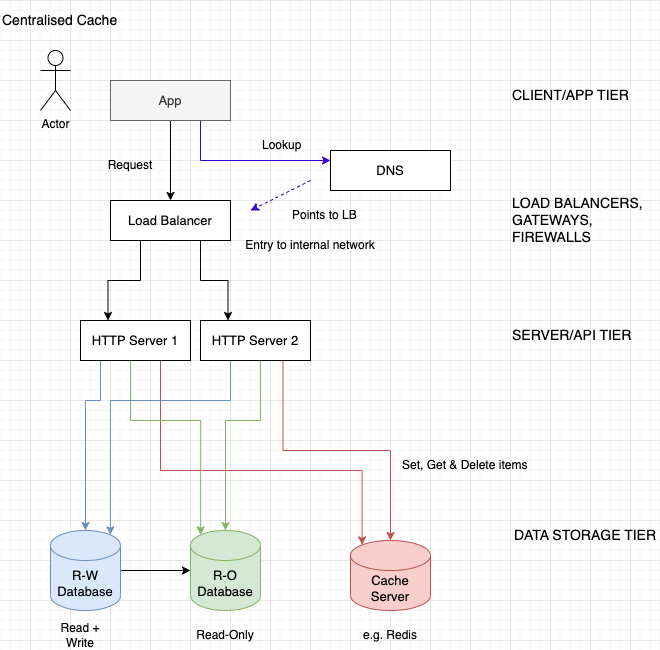
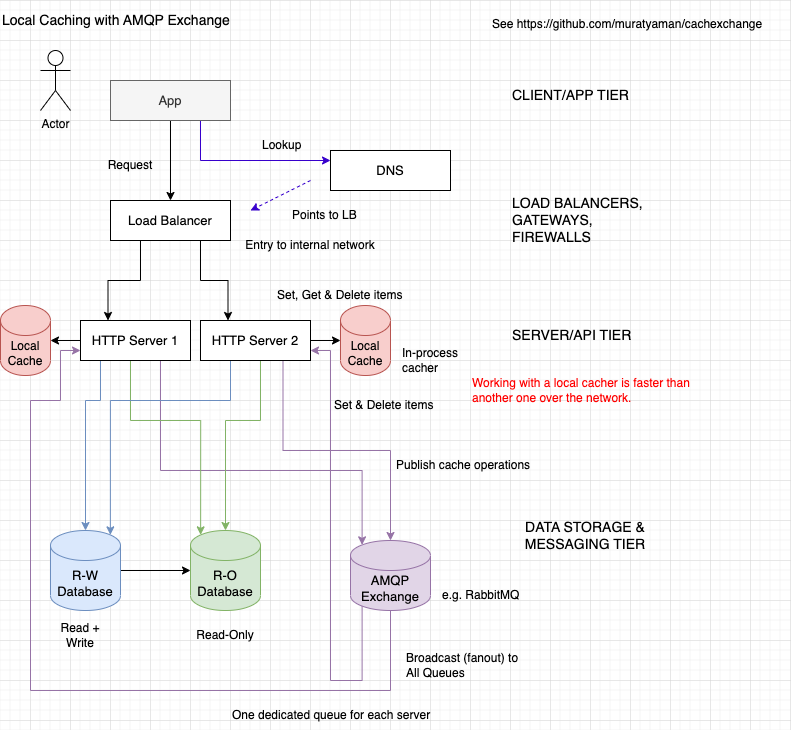

# CacheXchange

Faster caching solution using [node-cache](https://www.npmjs.com/package/node-cache) and amqp broker/exchange ([amqp-connection-manager](https://www.npmjs.com/package/amqp-connection-manager)).

## Centralised Caching



## Local in-process cacher with AMQP Exchange



## Install Node modules

This is not a library yet.

```sh
npm i
```

# Example

See folder `./example`

```sh
cd ./example
# terminal 1
npm i

cp .sample.env .env
# edit .env for RabbitMQ URL and exchange name
# on MacOS, you can use: brew install rabbitmq; brew services start rabbitmq

# start server 1
PORT=8081 node .

# terminal 2
cd ./example
# start server 2
PORT=8082 node .

# you can run more servers
#PORT=8083 node .
#PORT=8084 node .
#PORT=8085 node .

# terminal 3
# mimic client app
# this can generate random cache entries; sometimes it can hit cache
curl -X POST http://localhost:8081
curl -X POST http://localhost:8081

# generate cache entry using id on URL path
curl -X POST http://localhost:8081/10
curl -X POST http://localhost:8081/11
curl -X POST http://localhost:8081/12

# retrieve cached entry; it will expire after 60 seconds
curl http://localhost:8081/10

# other server should also have the same entry
curl http://localhost:8082/10
```
